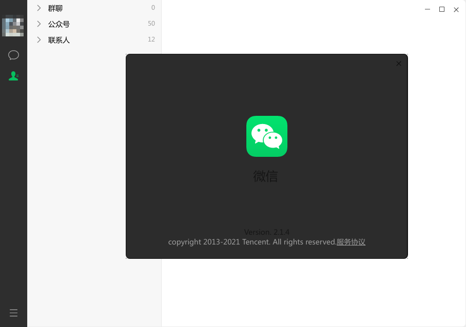
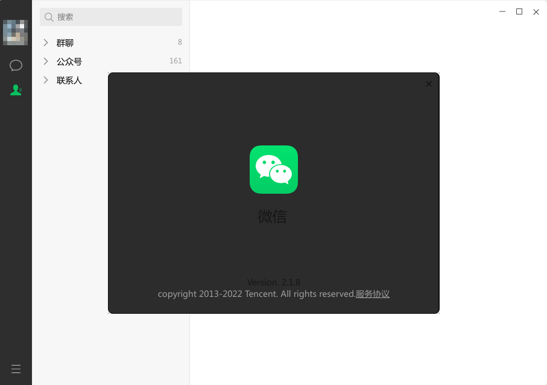

# Sneak-WeChat

WeChat （ UOS 👉 Ubuntu ）




> wechat.`2.1.4` for deepin 可能是现有最后一个能在ubuntu上安装的版本，之后的版本无法正常登陆，`2.1.5+`后会检查UOS的`libactivation.so`。
> 用`Electorn`的替换方式可以更新到新的版本。（依然落后其他平台2年+）。


### 流程

1. 安装[2.1.8](http://archive2.kylinos.cn/deb/kylin/production/PART-V10-SP1/custom/partner/V10-SP1/pool/all/weixin_2.1.8_amd64.deb)版本
2. 备份`locales`和`resources`
3. 安装[2.1.4](https://archive.ubuntukylin.com/software/pool/partner/weixin_2.1.4_amd64.deb)版本
4. 替换`locales`和`resources`


建议备份`2.1.4`的`/usr/lib/libactivation.so`文件。


### 其他

如无法登陆，尝试替换`/etc/lsb-release`。

```
DISTRIB_ID=Kylin
DISTRIB_RELEASE=V10
DISTRIB_CODENAME=kylin
DISTRIB_DESCRIPTION="Kylin V10 SP1"
DISTRIB_KYLIN_RELEASE=V10
DISTRIB_VERSION_TYPE=enterprise
DISTRIB_VERSION_MODE=normal
```

```bash
sudo cp /etc/lsb-release /etc/lsb-release.bak
sudo cat > /etc/lsb-release << EOF
DISTRIB_ID=Kylin
DISTRIB_RELEASE=V10
DISTRIB_CODENAME=kylin
DISTRIB_DESCRIPTION="Kylin V10 SP1"
DISTRIB_KYLIN_RELEASE=V10
DISTRIB_VERSION_TYPE=enterprise
DISTRIB_VERSION_MODE=normal
EOF
```
